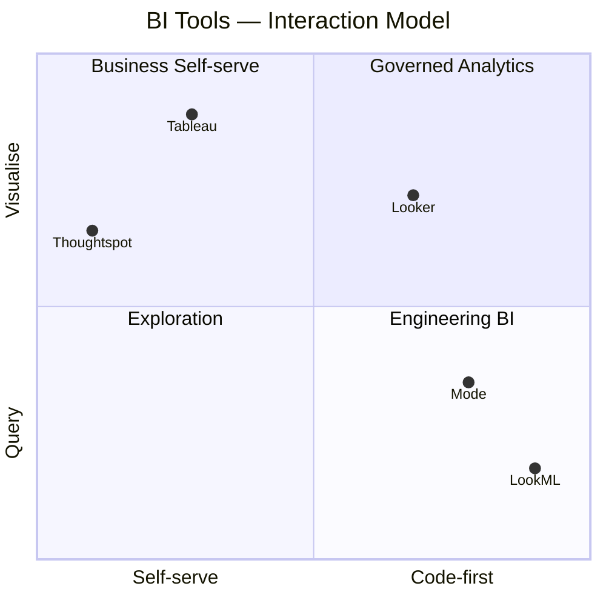
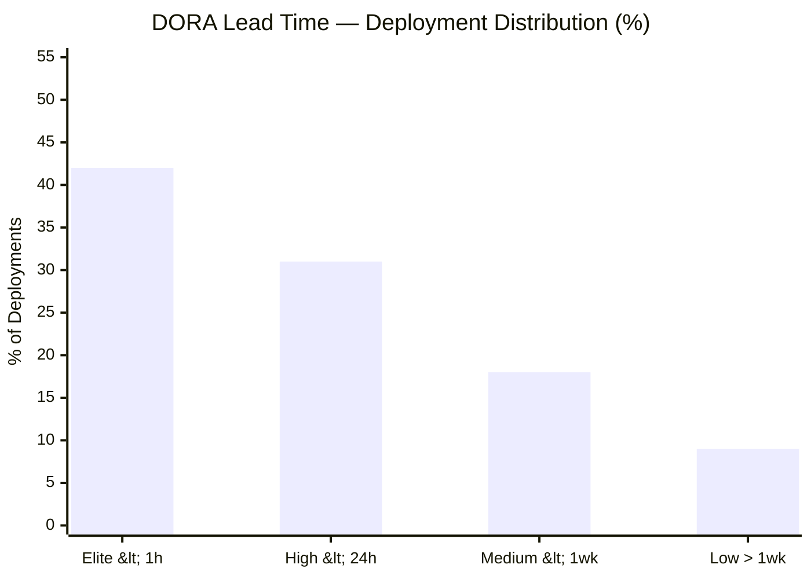
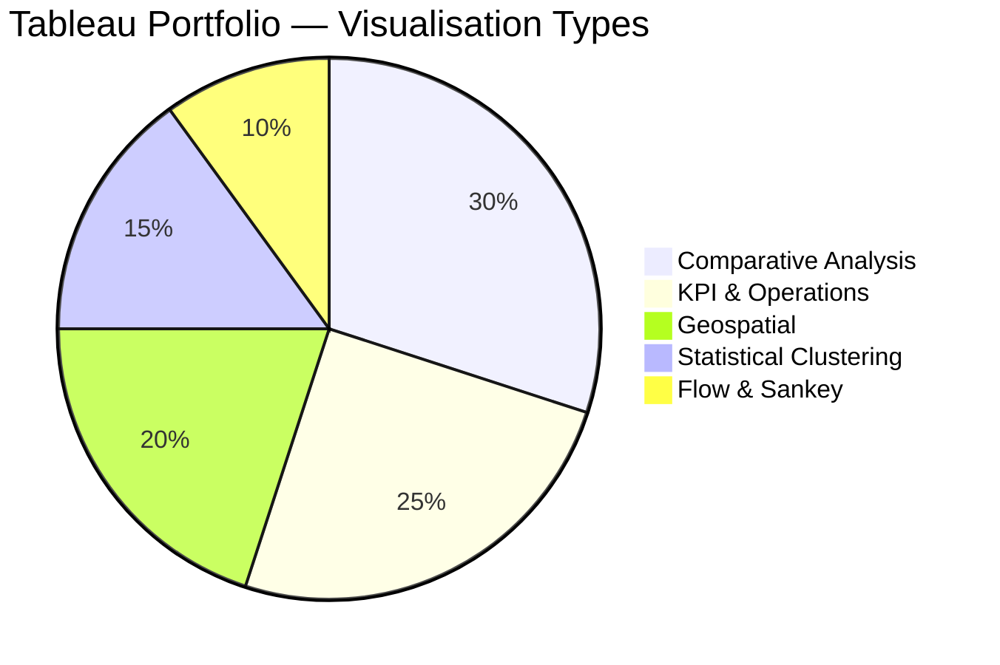

 

 

---

## ◈ The BI Stack

> Not all BI tools are created equal. Each occupies a distinct position across the **self-serve ↔ code-first** and **query ↔ visualise** axes. Knowing where to reach for which tool — and when to layer them — is the discipline.

**Looker** sits in governed analytics — business logic defined once in LookML, self-served across the org without analyst mediation. **Thoughtspot** achieves the same self-serve outcome through natural language search. **Mode** is the engineering analyst's tool: SQL-first, Python-ready, reproducible. **Tableau** excels where narrative and visual design matter most.

---

## ◈ LookML — GitHub Insights Model

The LookML project exposes the [GitHub Insights](https://github.com/ohderek/data-engineering-portfolio/tree/main/github-insights) pipeline as a governed Looker semantic layer — two explores, eleven joined tables, DORA lead time metrics, and code churn analysis built directly into the BI layer.

### DORA Lead Time Distribution

**42% Elite tier** — consistent with mature CI/CD and small-PR discipline. The 9% Low outliers trace to services with complex cross-repo deployment dependencies, surfaced directly by the `pct_sha_matched` quality KPI baked into the model.

### Key Design Decisions

| Decision | Rationale |
|---|---|
| `sql_always_where: is_bot = FALSE` | Bots excluded at the explore level — analysts physically cannot inflate PR counts |
| `is_ui_pr_diff_row` flag | Matches GitHub's PR diff UI exactly — merge commits only, lock files stripped |
| `sql_distinct_key` on churn sums | Prevents fan-out when reviews and commit files are simultaneously joined |
| Commit counts via bridge table | Stable COUNT DISTINCT regardless of which other one_to_many tables are in scope |
| `dora_bucket_sort` hidden dimension | Forces Elite → High → Medium → Low ordering — LookML has no native sort-by-field |

---

## ◈ Tableau — Data Storytelling

**[Full portfolio story →](https://public.tableau.com/app/profile/derek.o.halloran/viz/Portfolio_54/Story1)**&nbsp;&nbsp;&nbsp;**[All vizzes →](https://public.tableau.com/app/profile/derek.o.halloran/vizzes)**

### Visualisation Mix

Comparative and geospatial pieces dominate — both require deliberate design choices that summary tables obscure. The 10% Sankey slice belies its impact: **WorldWealthSankey** is the most-viewed piece in the portfolio.

### Featured Vizzes

| Viz | Category | What makes it land |
|---|---|---|
| **WorldWealthSankey** ⭐ | Flow & Sankey | Custom flow weighting · single annotated insight: 12 nations hold more than all of Africa |
| **Food Delivery KPIs** | KPI & Operations | Heat map calendar + scorecards — operations managers get the full picture in one view |
| **Messi vs Ronaldo** | Comparative | Mirrored bar chart — visual symmetry makes the comparison feel definitive |
| **GDP & Happiness** | Statistical | k-means clustering reveals three distinct wealth regimes with diminishing happiness returns |
| **Bridges to Prosperity** | Geospatial | Map + KPI tiles — 1.14M people served made tangible, not just counted |
| **Gender Pay Inequality** | Comparative | Diverging area chart — the gap becomes visceral, not statistical |

---

## ◈ Tech Stack

---

&nbsp;
&nbsp;
&nbsp;

  

