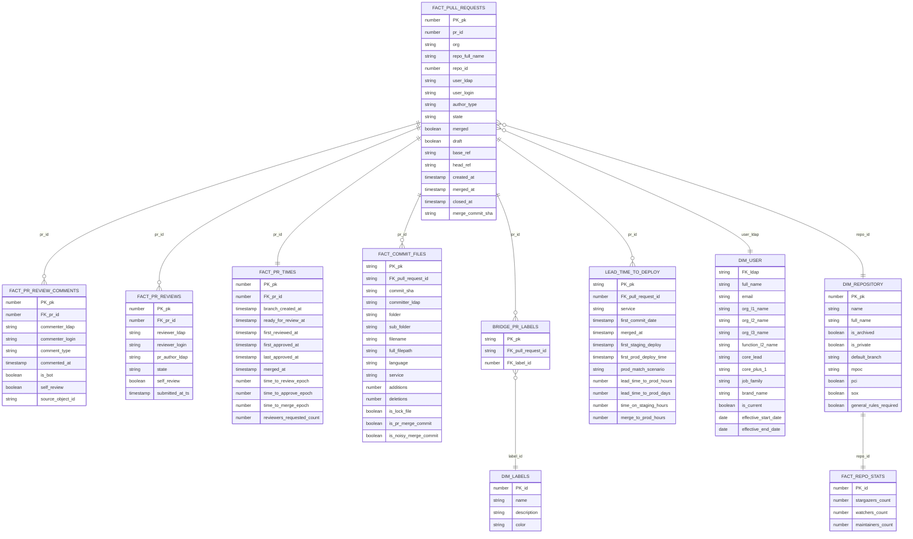

<div align="center">


<br/>


</div>

---

> **Good BI isn't about charts. It's about removing the space between a question and an answer.**
>
> This portfolio covers two layers of that: **Looker / LookML** for governed, self-serve analytics — and **Tableau** for data storytelling that makes insights land with stakeholders.

---

## LookML — GitHub Insights Model

The LookML project models GitHub PR and deployment data from the [GitHub Insights](https://github.com/ohderek/data-engineering-portfolio/tree/main/github-insights) pipeline into a governed Looker semantic layer.

Two explores: `fact_pull_requests` (PR velocity, code churn, review quality) and `dora_lead_time` (DORA metrics, SHA match quality gates).

### Model Architecture



### DORA Lead Time Distribution


**42% of deployments in the Elite tier** (<1 hour lead time). The `pct_sha_matched` quality KPI is surfaced directly in the BI layer — if it drops below 80%, the deployment tooling needs attention before the metric can be trusted.

### Key Design Decisions

| Decision | Why |
|---|---|
| `sql_always_where: is_bot = FALSE` on explore | Bot commits excluded by default — analysts can't accidentally inflate PR counts |
| `is_ui_pr_diff_row` flag in `fact_commit_files` | Matches exactly what GitHub shows in the PR diff UI — merge commits only, minus noisy merges and lock files |
| `sql_distinct_key` on churn measures | Prevents double-counting when commit files, reviews, and comments are all joined in the same query |
| Commit counts via `bridge_pr_commits_current` | Isolates commit COUNT DISTINCT from the commit files join, keeping measures stable regardless of which other tables are joined |
| `dora_bucket_sort` hidden dimension | Forces Elite → High → Medium → Low sort order (LookML has no native "sort by field" for strings) |
| `from:` aliases for reviewer/commenter dims | Reuses `dim_users` twice with different join aliases — avoids schema duplication while preserving team context for both reviewer and commenter breakdowns |
| SCD Type 2 `dim_users` | Point-in-time reports use a date-range join; current dashboards use `is_current = TRUE` |
| Dashboard-as-code | DORA dashboard versioned in LookML — deployed identically across dev / staging / prod |

### File Structure

```
lookml/
├── github_insights.model.lkml               Two explores + all join definitions
├── views/
│   ├── fact_pull_requests.view.lkml         Core PR grain · cycle time · bot detection
│   ├── fact_pr_times.view.lkml              Epoch-based lifecycle timing · first review/approval
│   ├── fact_commit_files.view.lkml          File churn · UI-accurate line counts · PR size
│   ├── fact_github_pr_reviews.view.lkml     Review events · approvals · changes requested
│   ├── fact_github_pr_review_comments.view  Inline + issue comments · excl. description
│   ├── fact_repo_stats.view.lkml            Stars · watchers · maintainers per repo
│   ├── lead_time_to_deploy.view.lkml        DORA lead time · SHA match · staging timing
│   ├── dim_user.view.lkml                   SCD2 engineer · full org hierarchy L1–L3
│   ├── dim_repository.view.lkml             Repo metadata · PCI/SOX compliance flags
│   ├── dim_labels.view.lkml                 GitHub label dimension
│   ├── bridge_pr_labels.view.lkml           M:M bridge · PR ↔ labels
│   └── bridge_pr_commits_current.view.lkml  M:M bridge · PR ↔ commits (fan-out guard)
└── dashboards/
    └── dora_metrics.dashboard.lkml          DORA KPIs · trend · bucket dist · by service/team
```

---

## Tableau — Data Storytelling

<div align="center">

**[View full portfolio story →](https://public.tableau.com/app/profile/derek.o.halloran/viz/Portfolio_54/Story1)**&nbsp;&nbsp;&nbsp;**[Browse all vizzes →](https://public.tableau.com/app/profile/derek.o.halloran/vizzes)**

</div>

<br/>

| Viz | Theme | Signature technique |
|---|---|---|
| **WorldWealthSankey** ⭐ | Global wealth distribution | Sankey flow with custom weighting · annotated insight: 12 nations hold more than all of Africa |
| **Food Delivery KPIs** | Operational performance | Heat map calendar · KPI scorecards · parameter-driven date selection |
| **Messi vs Ronaldo** | Sports analytics | Mirrored bar chart · image integration · calculated career totals |
| **GDP & Happiness** | Economics · well-being | k-means clustering · logarithmic axis · reference band annotations |
| **Bridges to Prosperity** | Humanitarian impact | Filled map + bar combo · 313 bridges · 1.14M people served · 22 nations |
| **Gender Pay Inequality** | Social data | Diverging area chart · trend annotations · time-series comparative storytelling |

---

## Tech Stack

<div align="center">


</div>

---

<div align="center">

<a href="https://www.linkedin.com/in/derek-o-halloran/">
  
</a>&nbsp;
<a href="mailto:ohalloran.derek@gmail.com">
  
</a>&nbsp;
<a href="https://public.tableau.com/app/profile/derek.o.halloran/viz/Portfolio_54/Story1">
  
</a>&nbsp;
<a href="https://github.com/ohderek/data-engineering-portfolio">
  
</a>

<br/><br/>


</div>
