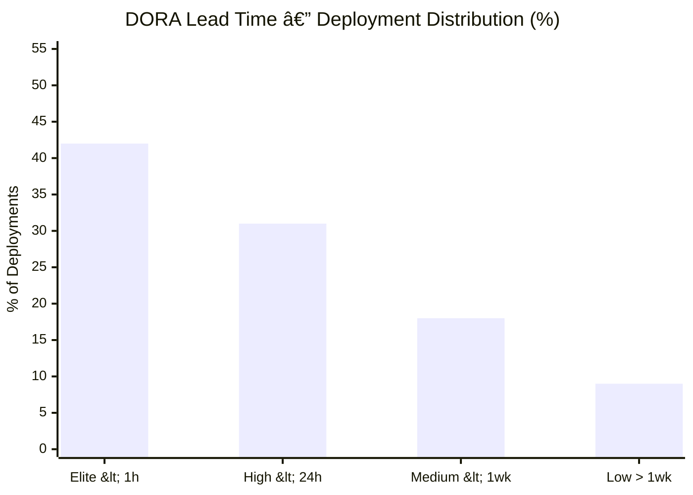

 

---

> **Good BI isn't about charts. It's about removing the space between a question and an answer.**
>
> This portfolio covers two layers of that: **Looker / LookML** for governed, self-serve analytics — and **Tableau** for data storytelling that makes insights land with stakeholders.

---

## LookML — Engineering Velocity

The LookML project models GitHub PR and deployment data from the [GitHub Insights](https://github.com/ohderek/data-engineering-portfolio/tree/main/github-insights) pipeline into a governed Looker semantic layer. Two explores power two distinct question sets.

### Model Architecture

```mermaid
flowchart LR
    subgraph SF["❄️  Snowflake · GITHUB_INSIGHTS"]
        T1[(FACT_PULL_REQUESTS)]
        T2[(LEAD_TIME_TO_DEPLOY)]
        T3[(DIM_USERS)]
    end

    subgraph V["📐  LookML Views"]
        V1[pr_facts]
        V2[lead_time_to_deploy]
        V3[dim_users SCD2]
    end

    subgraph E["🔍  Explores"]
        E1{{pr_velocity}}
        E2{{dora_lead_time}}
    end

    subgraph D["📊  Dashboards"]
        D1[DORA Metrics]
        D2[Engineering Velocity]
    end

    T1 --> V1
    T2 --> V2
    T3 --> V3
    V1 --> E1
    V3 --> E1
    V2 --> E2
    V1 --> E2
    V3 --> E2
    E1 --> D2
    E2 --> D1
```

### DORA Lead Time Distribution

**42% of deployments in the Elite tier** (<1 hour lead time). The `pct_sha_matched` quality KPI is surfaced directly in the BI layer — if it drops below 80%, the deployment tooling needs attention before the metric can be trusted.

### Key Design Decisions

| Decision | Why |
|---|---|
| `sql_always_where` on explores | Bot commits excluded by default — analysts can't accidentally inflate PR counts |
| `dora_bucket_sort` hidden dimension | Forces Elite → High → Medium → Low sort order (LookML has no native "sort by field" for strings) |
| SCD Type 2 `dim_users` | Point-in-time reports use a date-range join; current dashboards use `is_current = true` |
| `count_distinct` on `engineer_count` | Prevents fan-out inflation when dimension joins to a many-to-one fact |
| Dashboard-as-code | DORA dashboard versioned in LookML — deployed identically across dev / staging / prod |

---

## Tableau — Data Storytelling

**[View full portfolio story →](https://public.tableau.com/app/profile/derek.o.halloran/viz/Portfolio_54/Story1)**&nbsp;&nbsp;&nbsp;**[Browse all vizzes →](https://public.tableau.com/app/profile/derek.o.halloran/vizzes)**

 

| Viz | Theme | Signature technique |
|---|---|---|
| **WorldWealthSankey** ⭐ | Global wealth distribution | Sankey flow with custom weighting · annotated insight: 12 nations hold more than all of Africa |
| **Food Delivery KPIs** | Operational performance | Heat map calendar · KPI scorecards · parameter-driven date selection |
| **Messi vs Ronaldo** | Sports analytics | Mirrored bar chart · image integration · calculated career totals |
| **GDP & Happiness** | Economics · well-being | k-means clustering · logarithmic axis · reference band annotations |
| **Bridges to Prosperity** | Humanitarian impact | Filled map + bar combo · 313 bridges · 1.14M people served · 22 nations |
| **Gender Pay Inequality** | Social data | Diverging area chart · trend annotations · time-series comparative storytelling |

---

## Tech Stack

---

&nbsp;
&nbsp;
&nbsp;

  

